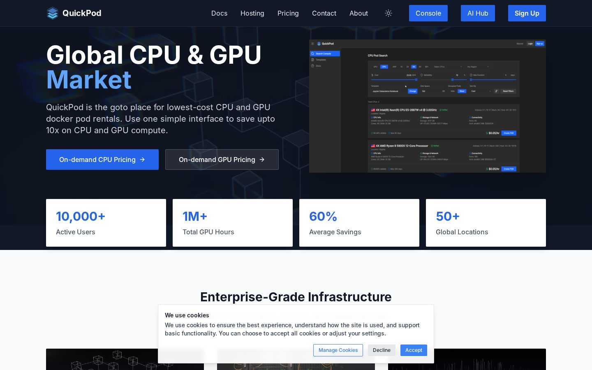

# QuickPod - Affordable GPU and CPU rentals

**Website: [quickpod.io](https://quickpod.io)**  |  Project page: https://asansanwal.github.io/quickpod.io/

QuickPod is the go-to place for the lowest-cost CPU and GPU Docker pod rentals: one simple interface to save up to 10x on compute, with Jupyter ready for TensorFlow, PyTorch or any other AI framework.

## Highlights

- **Global CPU and GPU market** - On-demand pricing for CPU and GPU pods, rented by the hour from providers around the world.
- **Smart resource allocation** - Advanced algorithms distribute compute so that every workload lands on the right hardware.
- **Enterprise security** - A state-of-the-art platform with built-in fault tolerance and redundancy.
- **Real-time analytics** - Comprehensive monitoring of your CPU and GPU machines while they run.
- **Ready for AI and ML** - Jupyter, TensorFlow, PyTorch and any framework you bring, on democratised idle compute power.
- **Docs, hosting and console** - Documentation, hosting options and a web console for the whole lifecycle of a pod.

## More projects

- [QuickOpen](https://quickopen.ai) - 100% AI-built open source software ([project page](https://asansanwal.github.io/quickopen.ai/))
- [Quick OS](https://quickopen.ai/aiquick-os) - A complete operating system that is actually yours ([project page](https://asansanwal.github.io/quickos/))
- [Common Screens](https://commonscreens.com) - Open web screenshot data ([project page](https://asansanwal.github.io/commonscreens.com/))
- [APIQuick](https://apiquick.io) - API marketplace for metered API integrations ([project page](https://asansanwal.github.io/apiquick.io/))
- [AIQuick](https://aiquick.io) - AI image, video and chat generation ([project page](https://asansanwal.github.io/aiquick.io/))
- [QuickAIHub](https://quickaihub.io) - Ship AI faster. Sell what you build. ([project page](https://asansanwal.github.io/quickaihub.io/))
- [QuickDigital](https://quickdigital.io) - Premium digital goods and services marketplace ([project page](https://asansanwal.github.io/quickdigital.io/))
- [WebsiteTools](https://websitetools.io) - One workspace for website checks ([project page](https://asansanwal.github.io/websitetools.io/))
- [Vansha](https://vansha.com) - Free family genealogy portal ([project page](https://asansanwal.github.io/vansha.com/))
